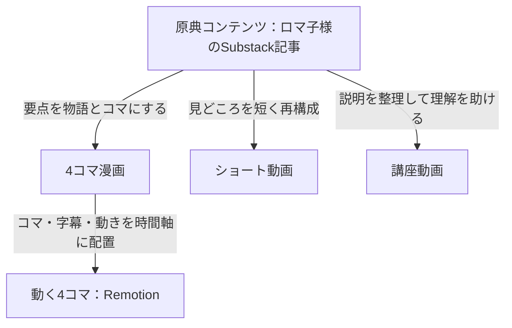
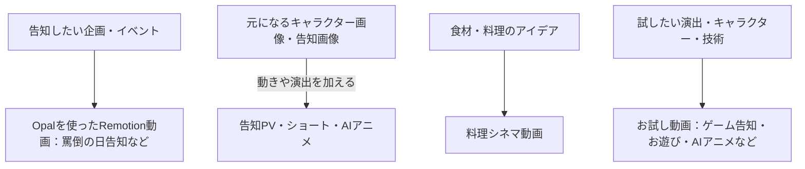

# Romaco-sama コンテンツ展開ショウケース設計図

作成日：2026-09-07 / 改修設計案・PR方針反映版 / 対象：トップページ

本書は設計のみ。画面・作品データの変更や公開は行わない。

## 1. 伝えたいこと

第一の目的は、ロマ子様のコンテンツを楽しんでもらい、原典の閲覧、動画視聴、シェア、活動への関心につなげること。サイト全体をロマ子様のPRとして設計する。

その体験の中で「記事や画像などの元ネタから、いろいろなプロモーションコンテンツが生まれる」「制作・演出を担当しているのは、はげだんご」と自然に伝える。制作力は、元ネタと完成作品の比較、媒体ごとの工夫、制作クレジットによって示す。

将来の制作依頼につながる認知・信頼づくりは副次的な目的とする。訪問者に読ませる説明はロマ子様の魅力を中心にし、営業目標やこの戦略自体はサイト上に書かない。

### 訪問者に起きてほしい気づき

1. 「ロマ子様、こんな漫画や動画もあるんだ」
2. 「これ、同じ記事や画像からできているんだ」
3. 「はげだんごさんが作っているんだ。自分のコンテンツでも相談できそう」

主な導線は作品視聴・原典閲覧・ロマ子様の活動先・シェア。制作担当のプロフィールや相談リンクは補助導線にする。問い合わせ数を優先してHeroを営業色の強い構成に変えない。

作品の入口を次の2系統に整理する。

- **記事から広がるコンテンツ**：原典と派生作品を、同じ記事単位でまとめる。
- **画像やアイデアから広がるロマ子様**：画像、告知素材、企画を起点とする告知、料理、お試し動画をまとめる。公開可能な元画像がある場合は、完成動画と対にして見せる。

Romaco-samaを主役とし、はげだんごは制作・演出担当としてクレジットする。英字表記はRomaco-sama / romacoに統一。公認を意味する肩書きは付けない。

## 2. 展開の基本図



これは提供できる展開の説明図。実作品の親子関係は、確認した制作経路に従って表示する。すべての作品が「記事→漫画→Remotion→ショート→講座」の順で制作されたような一本道にはしない。Remotion動画をShortsとして公開した場合は、同一作品に両方の属性を持たせ、別作品に水増ししない。

記事以外の制作は別の図で示す。



OpalやRemotionは制作手段、ショートや講座は成果物の形式として区別する。個々の作品に付ける使用ツールは、確認済みのものだけとする。

## 3. ページ全体の順番とコピー

| 順番 | セクション | 内容・役割 |
| --- | --- | --- |
| 1 | Hero | ロマ子様の魅力と、漫画・映像で楽しめることを提示 |
| 2 | 記事から広がるコンテンツ | 同じ記事と成果物を結ぶ、ページの主役となる展示 |
| 3 | ほかの記事の展開を見る | 7エピソードを記事別に探す入口 |
| 4 | 画像やアイデアから広がるロマ子様 | Opal×Remotion、料理、お試し動画の3グループ。元画像と完成映像の比較も掲載 |
| 5 | ロマ子様をもっと楽しむ・広める | Lit.Link、Substack、ゲーム、感想のシェアを主導線として配置 |
| 6 | 制作クレジット | はげだんごの担当範囲、Xプロフィール、小さな相談リンク |

Heroのコピー案：

> **読むロマ子様。動くロマ子様。広がるロマ子様。**
>
> あの記事、あの一枚から、漫画・ショート・講座、そして新しい映像へ。ロマ子様の言葉と世界観を、いろいろなかたちでお楽しみください。

Heroのボタン：「ロマ子様の作品を見る」「原典のSubstackを読む」。サブクレジット：「Produced by はげだんご @dango333」。制作相談はHeroや固定ヘッダーの強調ボタンにせず、フッター付近へ移す。

既存の宣伝動画・MVを最上部に独立して置く構成から、内容に応じた記事以外のグループへ移す案とする。作品・リンクは保持し、今後の並び替えは表示順データで変更できるようにする。

## 4. 主役となる記事展開のワイヤーフレーム

PCは、原典を横長の起点カードとして置き、その下に大きなサムネイル付きの3つの分岐を並べる。

```text
記事から広がるコンテンツ
同じテーマを、読む・見る・学ぶ体験へ。

記事を選ぶ [EP-0001 量子力学 ▼]

┌──────────────────────────────────────────────────┐
│ 原典記事   EP-0001 / 思考法                         │
│ 知らない方が幸せだった。                            │
│ 量子力学は、天才たちの正気を壊した                  │
│ 要約・原典の画像（用意できる場合） [原典を読む ↗]   │
└──────────────────────────────────────────────────┘
          │                   │                  │
      物語にする          短く届ける          わかりやすく教える
          ↓                   ↓                  ↓
┌────────────────┐ ┌────────────────┐ ┌────────────────┐
│ 4コマ漫画      │ │ ショート動画   │ │ 講座動画       │
│ 実際の漫画画像 │ │ 縦型サムネイル │ │ スライド画像   │
│ [漫画を見る]   │ │ [動画を見る]   │ │ [講座を見る]   │
└────────────────┘ └────────────────┘ └────────────────┘
          │
       漫画を動かす
          ↓
┌────────────────┐
│ 動く4コマ      │
│ Remotion動画   │
│ [動画を見る]   │
└────────────────┘
```

原典を含めて5種類を見せるが、5枚横並びにはしない。3列の大きいプレビューを維持し、動く4コマを漫画の直下に置いて親子関係を明示する。

### 表示・操作仕様

- 896px超：上記の3分岐。各分岐は同じ幅、動画の表示枠は高さ240〜320pxを目安にする。
- 736px超〜896px：2列。漫画と動く4コマは同一の分岐グループとして移動する。原典からの関係を各カードのラベルでも示す。
- 736px以下：1列。原典→漫画→動く4コマ→ショート→講座の順。ショート・講座には「この記事から展開」、動く4コマには「上の4コマから展開」と記載し、縦並びを制作順と誤解させない。
- 画像は実際の漫画・動画サムネイルを使用。漫画と講座スライドは全景を表示し、縦型動画にはスマホ比率の枠を使う。
- 動画は自動再生しない。初期実装は既存の公開先リンクで視聴できるようにする。モーダルが既に利用可能な場合は再利用し、カードごとに多数のプレイヤーを初期ロードしない。
- 漫画は拡大表示または該当ポータルの漫画位置へ遷移。原典はSubstackへ遷移する。
- 各派生カードには、形式名、実物プレビュー、変換の説明1文、視聴ボタンを配置。使用ツールは補助情報として小さく記載する。
- 記事の選択を変えると、原典とすべての派生作品が一緒に切り替わる。別記事の作品を混ぜない。
- 原典と関連成果物は通常のリンクでも辿れるようにし、キーボード操作・JavaScript無効時にも閲覧の入口を残す。
- 矢印は装飾として扱い、関係は文章でも読めるようにする。色や動きだけに依存しない。

### 全形式が揃っていない記事

公開できる作品だけを実物カードで表示する。未登録の形式にダミーサムネイルを配置しない。「掲載中：原典・ショート」のように現在の掲載範囲を示す。制作済みか未確認の作品を「制作中」「準備中」と断定しない。

## 5. ほかの記事の見せ方

エピソード単位の3列カードにする。各カードには記事タイトル、テーマ、原典プレビュー、公開確認できた形式のバッジ、「この原典の展開を見る」を置く。

選択時は、上の展開パネルを該当記事に切り替えて見出しへ移動する。スクロールは動きの低減設定を尊重し、キーボードのフォーカスも見出しへ移す。

初期対象：EP-0001、EP-0004、EP-0005、EP-0006、EP-0007、EP-0008、EP-0009。

従来のWorks形式フィルターは補助的な絞り込みとして残せるが、主たる閲覧単位は「記事とその展開」とする。単一のエピソードカードを複数形式に表示するだけでは、実物の派生作品が揃っている扱いにしない。

## 6. 記事以外の3グループ

見出し：**画像やアイデアから、こんなロマ子様も。**

説明：「イベントの告知、料理のワンシーン、ちょっと遊んだアニメまで。ここでも、ロマ子様の世界が広がっています。」

元画像を公開できる作品では「この一枚から → こんな映像に」という比較を置く。制作担当には伝わりやすい実績になり、ファンには変化を楽しめる展示になる。画像だけで講座などすべての形式に展開できると断定せず、素材と企画に合った実例を見せる。

| グループ | 表示コピー | 主な展示対象 |
| --- | --- | --- |
| Opal × Remotion | 伝えたい告知を、動きのある映像へ。 | 罵倒の日告知など、利用ツールを確認できた作品 |
| 料理動画 | 食材や料理を、シズル感のある映像へ。 | 既存の料理ショート、今後追加する料理作品 |
| お試し動画・映像ラボ | ゲーム告知も、お遊びも、AIアニメも。 | プロモーション、MV、ゲーム告知、実験的な映像 |

PCではグループの代表カードを3列表示。各カードの下に同じグループの作品一覧への入口を置く。狭い画面は2列→1列。作品が増えたときはグループごとの一覧を表示し、各作品のサムネイルを小さく詰め込まない。

MVなどの分類は表示順とともに後から変更可能にする。「お試し」は作品品質ではなく、自由な企画・技術実験をまとめるラベルとして使う。

制作クレジット案：

> 制作・演出：はげだんご @dango333
>
> ロマ子様の記事や画像をもとに、漫画・映像・講座へ。作品ごとに見せ方を考え、制作しています。

その下に通常の文字サイズで、強調ボタンにしない1行リンクを置く：

> お手元の記事や画像も、こんなふうに広げてみたい方は、制作担当のXへどうぞ。

料金表やフォームは追加しない。使用ツールや技術の説明は補助ラベルに留め、ロマ子様の作品名・見どころ・再生ボタンより目立たせない。作品ごとに役割が異なる場合は、実際の担当範囲を記載する。

## 7. 現在のデータから使える実例と確認事項

以下はローカルの登録内容に基づく対応案。外部リンクの現時点での到達・映像内容を検証した結果ではない。

| 対象 | 現在の登録内容 | 設計での扱い |
| --- | --- | --- |
| EP-0001 原典 | https://substack.com/@romaco/p-201420247 | 代表例の起点 |
| EP-0001 漫画 | ポータルの該当記事にcomic-headingのリンクあり | 同じ記事からの漫画として掲載候補 |
| EP-0001 ショート | 同じポータル記事にasset=shortのリンクあり | 同じ記事からのショートとして掲載候補 |
| EP-0001 講座 | 同じポータル記事にasset=lectureのリンクあり | 同じ記事からの講座として掲載候補 |
| EP-0001 動く4コマ | Remotionカテゴリはあるが専用の成果物リンクがない | 対応動画の確認後に実例の線を接続 |
| 4コマ動画 1PVJ6SJkLHo | 単独サンプル。episodeIdなし | 元漫画・記事・Remotion使用を確認して紐づけ |
| Remotion qKWwvM7l0R4 | 単独サンプル。episodeIdなし | 原典およびOpal使用の有無を確認して分類 |
| 講座 C4k87y6XJJQ | 単独サンプル。episodeIdなし | 対応記事を確認。EP-0001へ自動で紐づけない |
| 料理 qfpKfBIuMc4 | 料理動画として登録済み | 記事以外／料理動画 |
| 宣伝 rcqZ8HFt6_4・MV aHuVB-HqrlA | トップに独立サンプルとして登録済み | 記事以外／映像ラボの候補 |

確認が揃うまでは、一般的な展開図と実績表示を区別する。たとえばEP-0001にRemotion動画が未紐づけなら、その実例パネルに別テーマのRemotion動画を置かない。Opal動画も該当作品を特定するまでは実物カードを捏造しない。

## 8. 実装担当者向けのデータ設計

今のworksは「記事単位」と「動画単位」が混在している。既存のURLと作品IDを維持しつつ、原典・成果物・制作関係を分ける。

### episodes：原典記事の単位

| フィールド | 内容 |
| --- | --- |
| id | EP-0001などの固定ID |
| title / summary / sourceUrl | 原典タイトル、説明、原典URL |
| poster / posterAlt | 実物の画像がある場合のみ設定 |
| priority | 展開パネルや記事一覧の表示順 |

### works：実際の成果物の単位

| フィールド | 内容 |
| --- | --- |
| id | 動画または漫画アセットを識別する固定ID |
| collection | article-derived または original |
| episodeId | 記事由来のときだけ必須。存在するepisodesを参照 |
| sourceImageIds | 元になった画像がある場合の参照。記事以外の作品でも設定可能 |
| format | comic / motion-comic / short / lecture / videoなどの成果物形式 |
| tools | Remotion、Opal等。形式と混ぜない |
| originalGroup | 記事以外の場合：opal-remotion / cooking / experiments |
| parentWorkIds | 元になった漫画などのworks ID。直接記事から生成した作品は空配列 |
| relationshipVerified | 元記事・素材との関係が確認済みか |
| media / poster / externalUrl | 既存の動画ID・画像・視聴先を再利用 |
| published / priority | 公開状態と表示順 |

画像起点の比較用にsourceImagesを定義し、id、title、src、alt、creatorCredit、displayAllowedを保持する。公開してよい画像だけを比較表示し、制作者クレジットと素材の原作者クレジットを区別する。画像参照がない作品は完成品だけを表示する。元画像との関係にもrelationshipVerifiedを適用する。

記事を成果物worksにも重複登録しない。エピソード数と作品数を区別し、数字には「原典記事」「掲載作品」と明示する。複数カテゴリの同じ動画は1作品として数える。

バリデーション：存在しない参照、循環する親子関係、異なる記事間の誤接続、重複作品を検出する。関係が未確認の作品は別枠のサンプルとして保持し、原典からの矢印には接続しない。

### コンポーネント案

```text
HeroIntro                  コピーと2つの入口
ArticleExpansionSection    記事選択・原典と派生作品の表示
  SourceArticleCard        原典記事
  ExpansionBranch          変換説明・接続線・同一ルートの作品
  AssetPreviewCard         漫画・動画・スライドの実物プレビュー
EpisodeGallery             ほかの記事を選ぶ3列一覧
OriginalCreationSection    記事以外の3グループ
RomacoLinks                ロマ子様の活動先・シェア（主導線）
ProductionCredit           制作クレジット・Xへの小さな相談リンク
```

既存のWorkCard、SectionHeading、色・余白トークンを再利用する。Heroの固定サンプル配列と作品ファイルへの二重登録を減らし、掲載内容・順番は作品ID参照に一本化する。

## 9. 実装順と完成条件

1. 各動画の元記事・元漫画・元画像・使用ツールを照合し、公開可能な接続関係を確定する。
2. 原典と成果物のデータを分け、既存の作品リンクを移行する。
3. Heroと記事展開パネルを構築し、大きい3列プレビューで見せる。
4. 記事以外の3グループへ既存の宣伝・料理・MV等を配置する。
5. 記事切り替え、リンク、レスポンシブ、キーボード操作、参照整合性を検証する。
6. npm run validateでチェック・lint・テスト・buildを通す。GitHub Desktopからの公開手順を維持する。

完成条件：

- 初見でロマ子様のコンテンツを楽しむPRサイトだと理解でき、原典や活動先へ進める。
- 実例を見て「記事や画像から、さまざまなプロモーションコンテンツへ展開できる」と理解できる。
- 制作クレジットから、はげだんごの担当範囲と連絡先がわかる。相談導線は作品視聴やロマ子様の活動への導線を妨げない。
- 原典と実作品を同じテーマで見比べられる。
- 「漫画→動く漫画」の関係と、記事からの他の分岐を区別できる。
- 記事由来の作品と、告知・料理・実験映像が混ざらない。
- PCでは大きい3列サムネイル、スマートフォンでは読みやすい1列になる。
- サンプルの付け替えで架空の制作経路を作らず、各リンクは該当作品へ移動する。
- 元コンテンツや成果物が増えても、データ追加と表示順の変更で更新できる。
